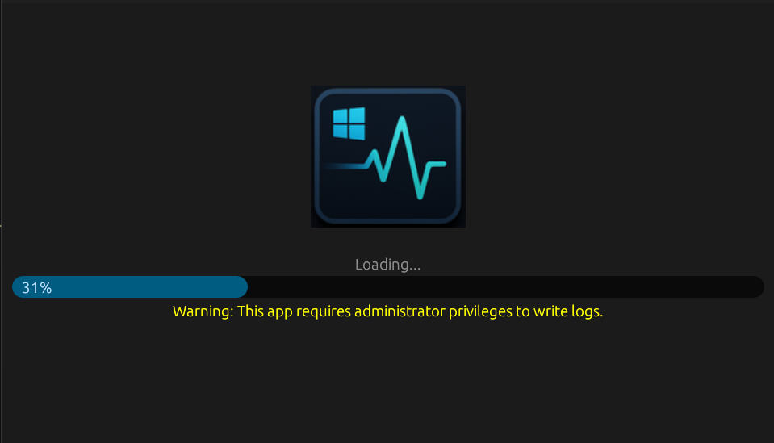
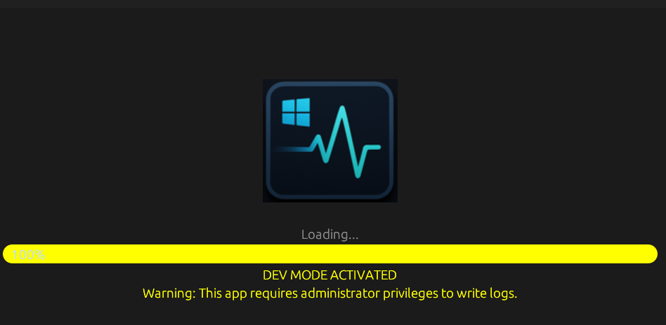
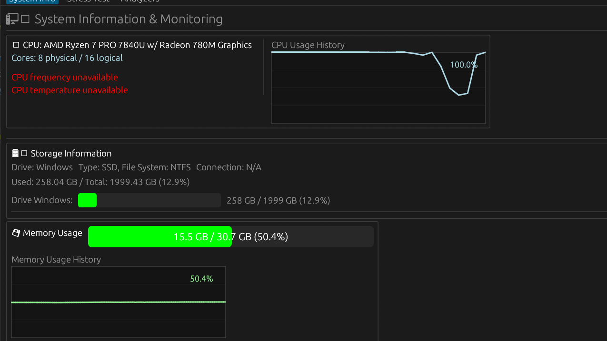
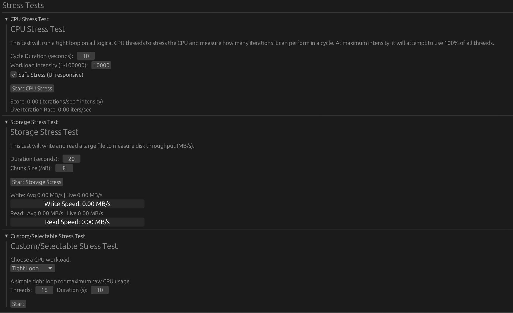
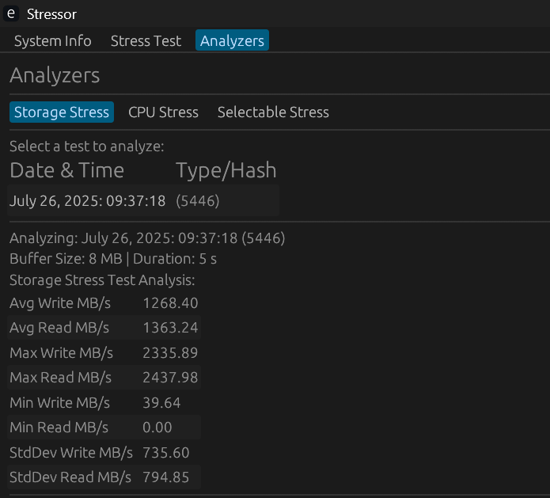

# Stressor

**Stressor** is a rust-built Windows stress tool, being made for me to learn Rust (is it better than C++? I shall seek those answers alike).

---

## Features

- **Real-Time System Monitoring**
  - Live CPU usage graph
  - Live RAM usage bar and history graph
  - Storage usage visualization for all drives
- **CPU Stress Test**
  - One-click stress test to push your CPU to its limits
  - Test results are logged and can be saved for later analysis
- **Test Analysis**
  - Analyze the last or any previous test in a dedicated analysis window
  - Custom format for test logs and results
- **User-Friendly**
  - Minimal setup: just run the EXE, click "Run" to start a test, and "Analyze" to review results
  - No command-line required for end users

---

## Getting Started

### Prerequisites

- **Rust** (latest stable, [install here](https://rustup.rs/))
- **Windows 10/11** (recommended) with test signing mode enabled and secure boot disabled (required for unsigned kernel drivers)
- **OpenGL 2.0** or higher for correct GUI loading

### Running from Source

1. **Clone the repository:**

   ```sh
   git clone <repo-url>
   cd Stressor
   ```

2. **Build and run:**

   ```sh
   cargo run 
   ```

## Running from Installer

1. **Launch Stressor_Installer.exe** and interactively install
   - You will need administrator access
   - This is just like installing any other application
   - The installer will upload Stressor into your Program Files (x64)
   - It will also create registry keys and make uninstalling just as easy
   - It will also create a desktop shortcut
2. **Launch Stressor as administrator**
   - Double-click the EXE shortcut on your desktop, or search for Stressor via start menu
   - You MUST launch stressor as an administrator or it will not be able to log and start thread testing
   - The application load/splash screen will start. If you wish to engage developer mode at this time (not recommended for end-users), spam the space bar before the progress bar ends
   - You will know you have entered developer mode when the progress bar flashes
   
   
3. **Monitor System**
   - The main window shows live CPU, RAM, and storage stats. Here, you can verify devices that will be stressed
   
4. **Run a Stress Test**
   - Switch to the stress tab at the top of the window
   - Run whichever test you would like!
   - Currently, there is a general CPU test, storage tests, and algorithmic tests
   
   Your system may freeze while CPU tests are being ran. This is normal!
5. **Analyze Results**
   - Use the "Analyze" feature to review the last or any saved test.
   - Results are shown in a user-friendly format.
   - If you wish to delete a result, you can right click twice
   

Note: Developer mode is only meant for Rust IDE development where the debug/ path exe is being ran.

---

## Contributing

Contributions are welcome! Please open issues or pull requests for bug fixes, features, or suggestions.

---

## License

This project is licensed under the MIT License
